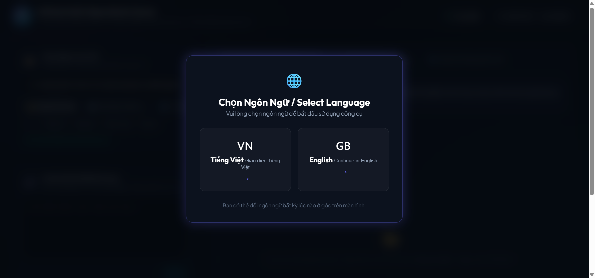
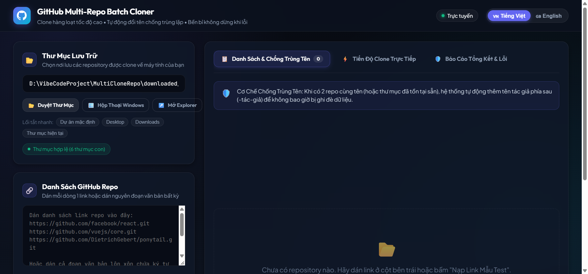
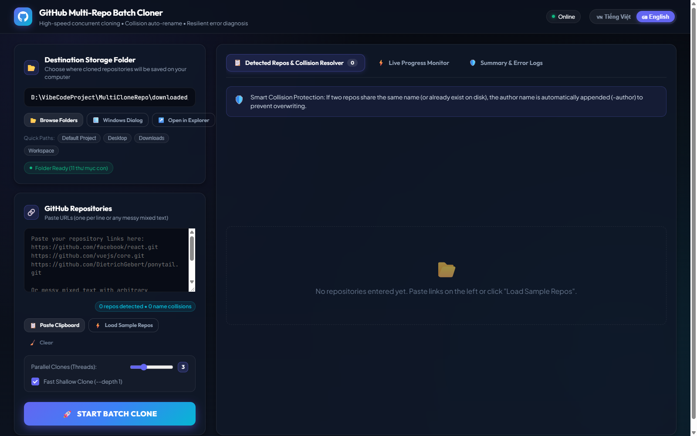
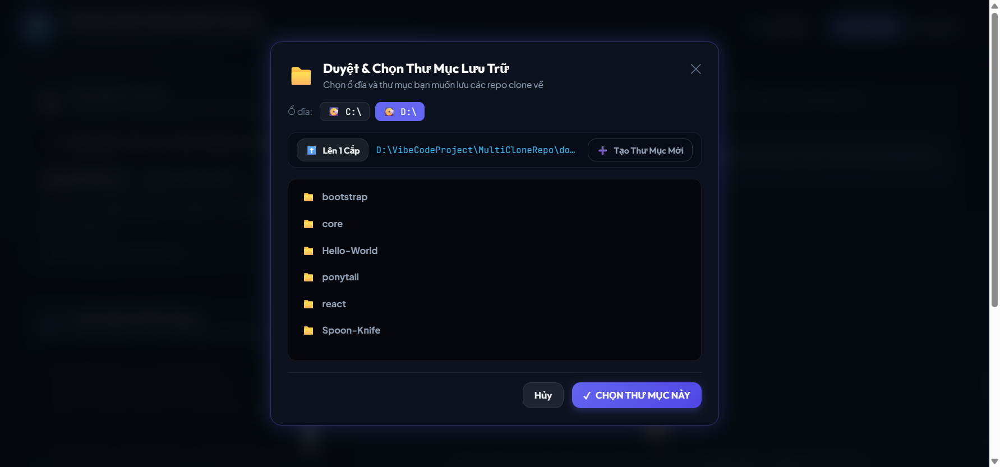
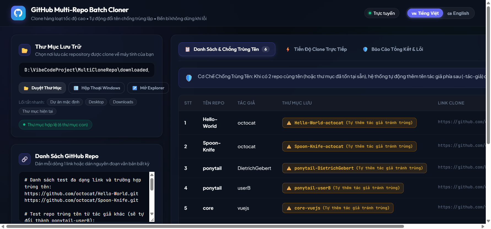
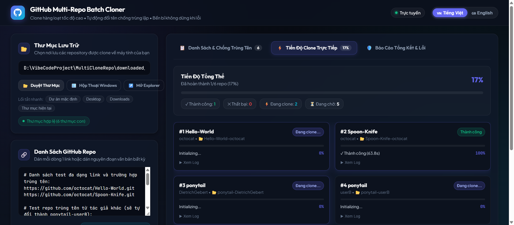
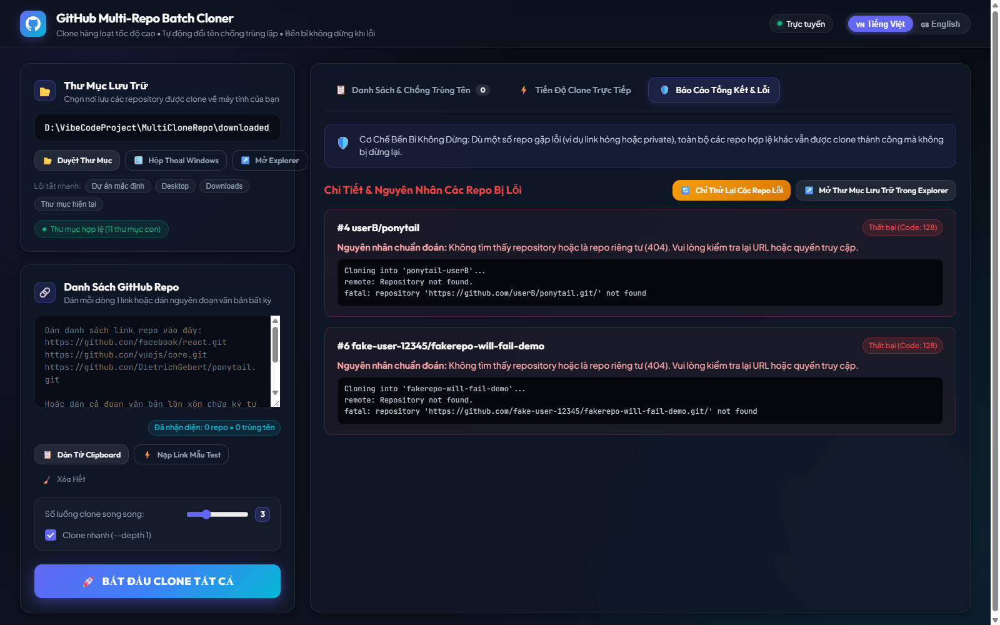

# 🚀 GitMultiClone

<p align="center">
  <b>Công Cụ Clone Hàng Loạt GitHub Repository Đa Luồng • Tự Động Đổi Tên Tránh Trùng Lặp • Bền Bỉ Không Dừng Khi Gặp Lỗi</b><br>
  <i>High-Speed Concurrent GitHub Repository Batch Cloner with Intelligent Collision Resolver & Resilient Error Diagnostics</i>
</p>

<p align="center">
  
  
  
  
  
</p>

---

## 📑 Mục Lục / Table of Contents
1. [🌟 Chạy 1 File Duy Nhất (Không Cần Cài Đặt)](#-chạy-1-file-duy-nhất---không-cần-cài-đặt)
2. [✨ Tính Năng Đột Phá & Ảnh Thực Tế](#-tính-năng-đột-phá--hình-ảnh-thực-tế)
   - [1. Modal Chọn Ngôn Ngữ Song Ngữ (VI / EN)](#1-modal-chọn-ngôn-ngữ-song-ngữ-tiếng-việt--english)
   - [2. Giao Diện Bảng Điều Khiển 2 Cột Hiện Đại](#2-giao-diện-bảng-điều-khiển-2-cột-hiện-đại-dark-mode)
   - [3. Bộ Duyệt Thư Mục Tích Hợp Web File Explorer](#3-bộ-duyệt-thư-mục-tích-hợp-web-folder-explorer-modal)
   - [4. Phân Tích Link & Tự Động Đổi Tên Chống Trùng Lặp](#4-phân-tích-link-linh-hoạt--tự-động-đổi-tên-chống-trùng-lặp)
   - [5. Bảng Theo Dõi Tiến Độ Đa Luồng Thời Gian Thực](#5-bảng-theo-dõi-tiến-độ-đa-luồng-thời-gian-thực)
   - [6. Cơ Chế Bền Bỉ & Báo Cáo Chẩn Đoán Lỗi Chi Tiết](#6-cơ-chế-bền-bỉ-fault-tolerant--báo-cáo-chẩn-đoán-lỗi)
3. [📖 Hướng Dẫn Sử Dụng Chi Tiết Từng Bước](#-hướng-dẫn-sử-dụng-chi-tiết-từng-bước)
4. [🛠️ Các Cách Khởi Chạy Công Cụ](#️-các-cách-khởi-chạy-công-cụ)
5. [⚙️ Cơ Chế Kỹ Thuật Đằng Sau](#-cơ-chế-kỹ-thuật-đằng-sau)
6. [❓ Câu Hỏi Thường Gặp (FAQ)](#-câu-hỏi-thường-gặp-faq)

---

## 🌟 Chạy 1 File Duy Nhất - Không Cần Cài Đặt!

Bạn không cần biết lập trình, không cần cài đặt Node.js hay Python, và **không cần clone cả dự án này về**! 

Chỉ cần tải đúng **1 file duy nhất** tại mục **Releases**:
### 👉 📥 **[Tải Xuống GitMultiClone.exe (Phiên bản v1.0.0)](https://github.com/ThinhChauTran263/GitMultiClone/releases/download/v1.0.0/GitMultiClone.exe)** *(Dung lượng ~7.7 MB)*
*(Hoặc vào mục [GitHub Releases](https://github.com/ThinhChauTran263/GitMultiClone/releases) để xem tất cả các bản phát hành)*

- **Cách dùng cực đơn giản**:
  1. Tải về và nhấp đúp chuột vào file `GitMultiClone.exe`.
  2. Máy chủ chạy ngầm tức thì, trình duyệt web tự động mở ra tại địa chỉ `http://localhost:3456`.
  3. Sử dụng ngay lập tức với đầy đủ tính năng 100%!

---

## ✨ Tính Năng Đột Phá & Hình Ảnh Thực Tế

### 1. Modal Chọn Ngôn Ngữ Song Ngữ (Tiếng Việt & English)
Ngay khi mở ứng dụng lần đầu, bạn sẽ được chào đón bằng cửa sổ lựa chọn ngôn ngữ trực quan. Bạn có thể chọn giao diện **Tiếng Việt 🇻🇳** hoặc **English 🇬🇧** tùy ý. Ngoài ra, bạn có thể chuyển đổi ngôn ngữ bất kỳ lúc nào ngay trên thanh điều hướng phía trên mà không làm mất dữ liệu đang nhập.



---

### 2. Giao Diện Bảng Điều Khiển 2 Cột Hiện Đại (Dark Mode)
Thiết kế chuẩn công thái học với phong cách **Glassmorphism Dark Mode**:
- **Cột Trái (Controls)**: Cấu hình thư mục lưu trữ, khung dán link GitHub, tùy chỉnh số luồng song song (1 - 8 luồng), chế độ Clone nhanh Shallow Clone (`--depth 1`), và các nút thao tác.
- **Cột Phải (Tabs Inspector)**: Hệ thống 3 tab trực quan gồm **Bảng Xem Trước**, **Giám Sát Tiến Độ Trực Tiếp**, và **Báo Cáo Chẩn Đoán Lỗi**.

#### Giao diện Tiếng Việt:


#### Giao diện English:


---

### 3. Bộ Duyệt Thư Mục Tích Hợp (Web Folder Explorer Modal)
Không còn tình trạng hộp thoại Windows bị treo, ẩn sau trình duyệt hay không tương thích:
- Hỗ trợ nút duyệt trực tiếp ổ đĩa (`C:\`, `D:\`, ...) ngay trên trình duyệt web.
- Hiển thị cây thư mục mượt mà, hỗ trợ nút **Lên 1 Cấp (Up Level)** và nút **Tạo Thư Mục Mới**.
- Vẫn giữ nguyên tùy chọn mở hộp thoại Windows truyền thống hoặc dán đường dẫn trực tiếp.
- Có sẵn nút **"Mở Explorer"** để mở thư mục lưu trữ trên máy tính chỉ với 1 cú click!



---

### 4. Phân Tích Link Linh Hoạt & Tự Động Đổi Tên Chống Trùng Lặp

#### 🛡️ Cơ chế giải quyết trùng tên thông minh:
Khi bạn clone nhiều repository có cùng tên (ví dụ: `tacgiaA/ponytail.git` và `tacgiaB/ponytail.git`):
- Repo đầu tiên được lưu dưới tên gốc: `ponytail`.
- Repo tiếp theo có cùng tên sẽ **tự động thêm tên tác giả phía sau**: `ponytail-tacgiaB`.
- Nếu trên ổ cứng đã tồn tại sẵn thư mục cùng tên, công cụ tự phát hiện và thêm tên tác giả để tránh ghi đè hoặc xung đột Git!
- Bảng hiển thị huy hiệu cảnh báo vàng **"Tự động đổi tên (tránh trùng)"** rõ ràng trước khi bấm clone.

#### 🔗 Trích xuất URL cực kỳ thông minh:
- Cho phép dán định dạng chuẩn: mỗi hàng 1 link repo.
- Hoặc dán cả đoạn văn bản lộn xộn, dài ngoằng chứa link lẫn lộn dấu ngoặc kép, dấu phẩy, văn bản tiếng Anh/Việt. Regex tự động bóc tách chính xác toàn bộ link Git hợp lệ!



---

### 5. Bảng Theo Dõi Tiến Độ Đa Luồng Thời Gian Thực
- Hỗ trợ thanh trượt tùy chỉnh số luồng song song từ **1 đến 8 luồng đồng thời**.
- Thanh tiến độ tổng thể hiển thị tỷ lệ hoàn thành dạng phần trăm và số lượng (`8/8 hoàn tất - 100%`).
- Từng repository có thanh tiến độ độc lập hiển thị chi tiết từng giai đoạn Git:
  - `Cloning...`
  - `Receiving objects: 45% (3.20 MiB/s)`
  - `Resolving deltas: 100%`
  - `Success` (Thành công) hoặc `Failed` (Thất bại)



---

### 6. Cơ Chế Bền Bỉ (Fault-Tolerant) & Báo Cáo Chẩn Đoán Lỗi

#### ⚡ Không bao giờ dừng lại giữa chừng:
Khi bạn clone 10 hoặc 50 repository cùng lúc, nếu chẳng may repo số 4 hoặc 6 bị lỗi (do link sai 404, repo private yêu cầu đăng nhập, mất kết nối mạng):
- **GitMultiClone KHÔNG DỪNG LẠI!**
- Hệ thống tự động bỏ qua repo lỗi, dọn dẹp thư mục rác trống và tiếp tục clone toàn bộ các repository hợp lệ còn lại cho đến khi hoàn thành 100%.

#### 🩺 Báo cáo chẩn đoán lỗi chuyên sâu:
Tab **Báo Cáo Lỗi** tự động phân loại nguyên nhân:
- ❌ **Lỗi 404 / Private Repo**: Repository không tồn tại hoặc là repo riêng tư cần quyền truy cập.
- 🔒 **Lỗi Xác Thực (Authentication)**: Sai SSH key hoặc thông tin đăng nhập.
- 🌐 **Lỗi Mạng (Network Timeout)**: Mất kết nối tới máy chủ GitHub.
- Hiển thị nguyên văn toàn bộ dòng lệnh Git và đoạn log lỗi `stderr` để người dùng kiểm tra.
- Nút **"Chỉ Thử Lại Các Repo Lỗi"** giúp bạn retry nhanh chóng mà không cần clone lại từ đầu các repo đã thành công!



---

## 📖 Hướng Dẫn Sử Dụng Chi Tiết Từng Bước

### Bước 1: Chọn Thư Mục Lưu Trữ
- Nhập đường dẫn thư mục bạn muốn lưu repo (ví dụ: `D:\VibeCodeProject\MultiCloneRepo\downloaded_repos`).
- Hoặc bấm **"Duyệt Thư Mục"** để chọn ổ đĩa và thư mục trực quan.
- Bạn cũng có thể bấm vào các lối tắt nhanh: *Dự án mặc định*, *Desktop*, *Downloads*.

### Bước 2: Dán Danh Sách Repository
- Dán danh sách link GitHub vào ô văn bản. Có thể dán mỗi dòng 1 link hoặc dán một đoạn văn bản bất kỳ có chứa link.
- Bấm **"Phân Tích & Xem Trước"** (hoặc bấm **"Tải Link Mẫu"** để thử nghiệm ngay).

### Bước 3: Xem Trước & Kiểm Tra Xung Đột Tên
- Xem bảng danh sách tại Tab 1: Kiểm tra xem có repo nào bị trùng tên và được gắn đuôi tác giả hay không.
- Điều chỉnh số luồng song song (mặc định 3 luồng) và chọn bật/tắt chế độ **Shallow Clone (`--depth 1`)** để tăng tốc tối đa.

### Bước 4: Bắt Đầu Clone
- Nhấn nút xanh lớn **"BẮT ĐẦU CLONE"**.
- Màn hình tự động chuyển sang Tab 2 (Giám Sát Tiến Độ), bạn sẽ thấy các worker tải về đồng thời với tốc độ và phần trăm nhảy liên tục.

### Bước 5: Xem Kết Quả & Mở Thư Mục
- Khi hoàn tất, âm thanh thông báo vang lên kèm popup kết quả tổng kết.
- Nếu có repo bị lỗi, chuyển sang Tab 3 để xem chẩn đoán nguyên nhân và bấm **"Chỉ Thử Lại Các Repo Lỗi"** nếu cần.
- Bấm **"Mở Explorer"** để xem các thư mục mã nguồn đã được tải về trọn vẹn trên máy tính của bạn.

---

## 🛠️ Các Cách Khởi Chạy Công Cụ

| Phương Thức | Đối Tượng Sử Dụng | Yêu Cầu Cài Đặt | Lệnh Khởi Chạy |
| :--- | :--- | :--- | :--- |
| **1. File `GitMultiClone.exe`** | Người dùng cuối, tiện nhất, nhanh nhất | **Không cần cài gì cả** | Nhấp đúp vào `GitMultiClone.exe` |
| **2. File `start.bat`** | Người dùng Windows có sẵn Node | Node.js | Nhấp đúp vào `start.bat` |
| **3. Node.js Terminal** | Lập trình viên Node | Node.js (v18+) | `npm start` |
| **4. Python Terminal** | Lập trình viên Python | Python 3.8+ (chỉ dùng stdlib) | `python standalone.py` |

### Hướng Dẫn Tự Đóng Gói Lại File `.exe`
Nếu bạn chỉnh sửa mã nguồn giao diện trong thư mục `public/` và muốn đóng gói lại thành file thực thi `.exe` duy nhất:
```powershell
# Chạy lệnh npm build đã được cấu hình sẵn với PyInstaller:
npm run build:exe
```
File `GitMultiClone.exe` dung lượng chỉ ~7.7 MB sẽ được tạo mới ngay tại thư mục gốc.

---

## ⚙️ Cơ Chế Kỹ Thuật Đằng Sau

1. **Khử Treo Git Credential Manager (GCM Deadlock Prevention)**:
   - Trên hệ điều hành Windows, khi chạy lệnh `git clone` ngầm với một repo private hoặc repo không tồn tại, Git thường tự động bật hộp thoại đăng nhập đồ họa hoặc treo vĩnh viễn ở tiến trình nền.
   - **GitMultiClone** đã triệt để xử lý bằng cách tiêm các biến môi trường:
     ```bash
     GIT_TERMINAL_PROMPT=0
     GIT_ASKPASS=""
     GCM_INTERACTIVE="never"
     ```
   - Nhờ đó, mọi lỗi 404 hay lỗi xác thực đều trả về kết quả lỗi ngay lập tức trong vài giây thay vì bị treo đơ tiến trình!

2. **Dọn Dẹp Thư Mục Rác Thông Minh (Orphaned Folder Cleaner)**:
   - Khi lệnh clone thất bại, Git có thể để lại một thư mục rỗng trên đĩa cứng. Hệ thống tự động kiểm tra và xóa thư mục rác này ngay lập tức để tránh làm bẩn ổ đĩa của bạn.

3. **Cơ Chế Kết Nối Kép WebSocket & SSE**:
   - Khi chạy bằng Node.js: Dữ liệu tiến độ được truyền tải siêu tốc qua giao thức **WebSocket** (`ws://`).
   - Khi chạy bằng Python standalone (`GitMultiClone.exe`): Tự động chuyển đổi sang giao thức **Server-Sent Events (SSE)** tương thích tuyệt đối mà không cần cài đặt thêm bất kỳ thư viện ngoài nào.

---

## ❓ Câu Hỏi Thường Gặp (FAQ)

**Q: Tôi có cần cài đặt phần mềm Git trên máy tính không?**  
> **A:** Có. Máy tính của bạn cần cài đặt sẵn Git (đã có trong biến môi trường `PATH`). Bạn có thể tải Git chính thức tại [git-scm.com](https://git-scm.com/).

**Q: Nếu một repo có dung lượng quá lớn thì sao?**  
> **A:** Mặc định chế độ **Fast Shallow Clone (`--depth 1`)** được bật sẵn. Chế độ này chỉ tải commit mới nhất mà không tải toàn bộ lịch sử commit từ xưa đến nay, giúp tiết kiệm đến 80-90% dung lượng đĩa và thời gian tải!

**Q: Dữ liệu của tôi có bị gửi ra ngoài không?**  
> **A:** Hoàn toàn không. Toàn bộ mã nguồn chạy cục bộ 100% trên máy tính của bạn (`localhost`), an toàn và bảo mật tuyệt đối.

---

<p align="center">
  Phát triển với ❤️ cho cộng đồng lập trình viên Việt Nam và Quốc tế.<br>
  <b>GitMultiClone</b> — <i>Fast, Safe, and Resilient Batch Cloning.</i>
</p>
